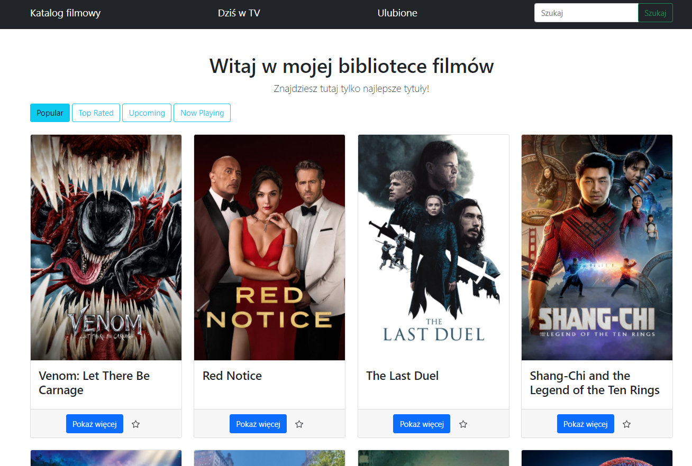

# Flask-App-with-TMDB-API

Movies app built with Flask and TMDB API.  
In this app you can search movies and series. Sort them by ratings, popularity etc. 
Check wheather they are being played in cinemas. It also allows to see detailed information about movies such as cast, description, budget. 
There is also possibility to add movies to your favourites.  

How to use: 
- clone this repository 
- run command: pip install -r requirements.txt 
- register on <a href="https://www.themoviedb.org/">themoviedb</a>  and request your API Read Access Token(v4 auth) in API section
- run this command to set an enviroment variable: 
-Windows: set TMDB_API_TOKEN="your api token" 
-Linux: export TMDB_API_TOKEN="your api token" 
- run command 'python main.py' to start a server  

Or check this app on heroku <a href="https://tmdbapiflaskapp.herokuapp.com/">here</a>  

